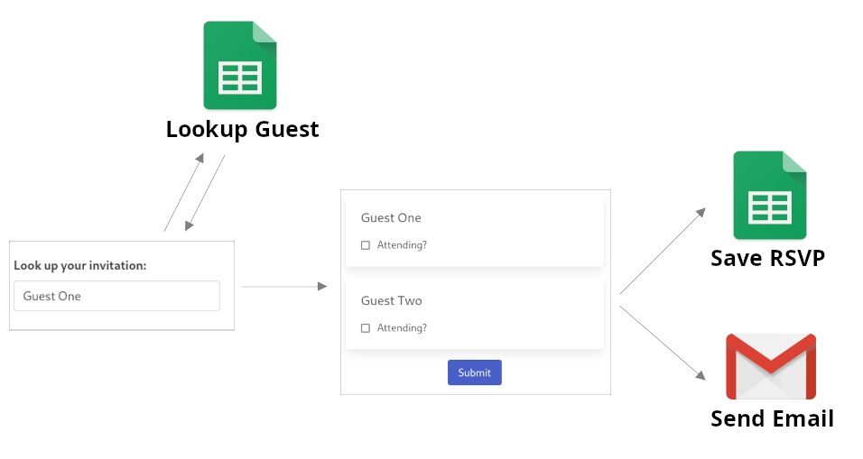
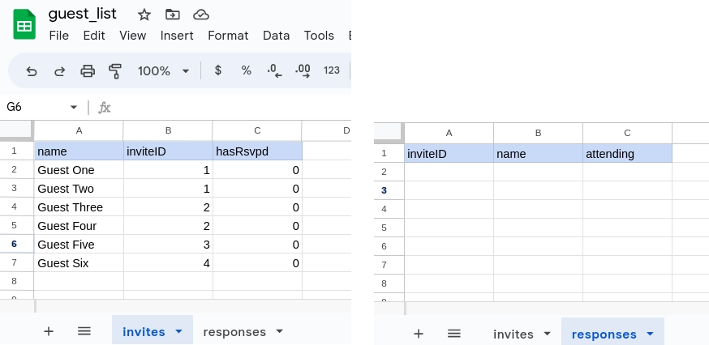
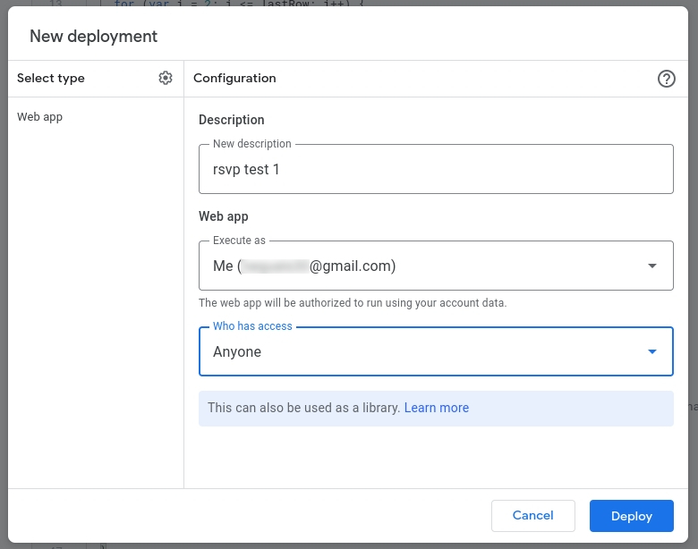
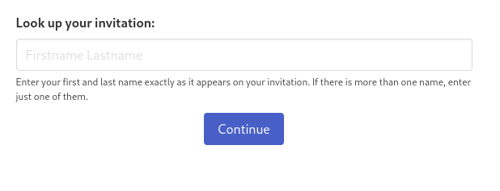
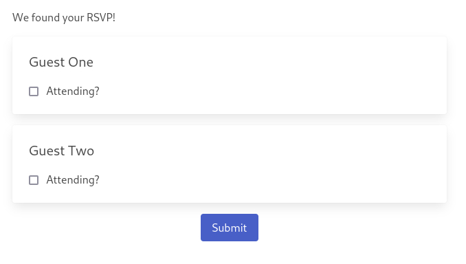
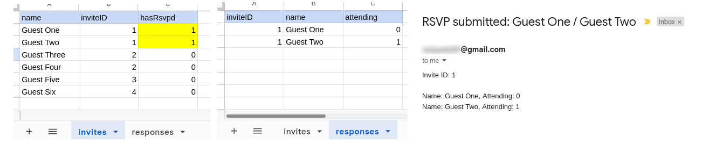

# RSVP Form with Google Apps Script
Have you ever wanted an RSVP form for an event, but didn't want to use a third-party alternative which tracks your data, isn't customizable and costs money?

This is a fully DIY solution, and there are some advantages to doing it this way:

* __Convenience__: Your guest's RSVP responses automatically get saved to a Google Sheet and emailed to you.
* __Control__: Fully integrates into your website and styled by you. You control every detail. 
* __Simplicity__: No "backend" to maintain. Just one Javascript file, without dependencies, that can be hosted anywhere (e.g. Github Pages)
* __Price__: Free to use, don't need to pay for hosting.
* __Privacy__: you're collecting the data yourself.

---
## Overview

Here is an overview of how the process works:

1. Your guests __enter their name__ (or the name of one of the guests in their party)
2. It checks whether they are on the guest list
3. It __makes the RSVP form__ for all the guests in that guest's party
4. It __saves their submission__ back to the Google Sheet 
5. It __sends you an email__ with their results
6. It __marks them as having RSVP'd__, so they can't RSVP again

---
## Getting Started
### Step 1: Set up the Google Sheet
> Note: I created a separate Gmail account and used that account to make these Google sheets and code. You may also want to do that before proceeding.

In Google Sheets, create a spreadsheet. It should have two tabs, one named "__invites__", which should have 3 columns: (name, inviteID, hasRsvpd). The other one should be named "__responses__" and should have 3 or more columns (inviteID, name, attending), and whatever other fields you want to keep track of:

### Step 2: Create the Apps Script
In the Google Sheet, create the Apps Script that will power the server side of things. In Google sheets, go to `Extensions` >> `Apps Script`. Replace the default "myFunction" with the [appsScript.js function from this repo](./appsScript.js).

__NOTE__: In this code, there is a line that references `YOUR_EMAIL@gmail.com`. __Replace this with your actual email__.

Next, you'll need to deploy the web app. Hit the big "Deploy" button at the top, then "New deployment". There, `Select Type` >> `Web app`. Enter a description. For "Execute as", leave the default (your gmail account), and importantly, switch "Who has access" to "Anyone".

Since you're allowing anyone on the internet to run this script, it's going to give you a bunch of warnings now. First, press "Authorize access". That will create a pop up where you will need to sign into your account. Then, there will be a screen telling you that "Google hasn't verified this app". You will need to press `Advanced` >> `Go to your_script_name (unsafe)`. Finally, you will need to press "Allow".

Google will give you your deployment ID and a URL with which your app can be called. __Keep this URL, it will be needed in the next step__.

### Step 3: Create the Client-Side Form Javascript
Here you have two choices:
1) Simple -- just the raw, basic HTML and basic Javascript you need to get this working. Use the files [simple_form.html](./simple_form.html) and [simple_rsvp.js](./simple_rsvp.js) in this repo.
2) Styled -- Same thing, but with CSS styling using Bulma CSS. Use the files [styled_form.html](./styled_form.html) and [styled_rsvp.js](./styled_rsvp.js) in this repo.

__NOTE:__ In the Javascript function (either _simple_rsvp.js_ or _styled_rsvp.js_), you will need to __change this:__ `YOUR_GOOGLE_APPS_SCRIPT_ID` to the ID you copied in the step above.

At this point, everything is in place and should be ready to be used.

---
## What it Looks Like
When the guest navigates to the HTML form, they should get something that looks like this:

When they type in their name and hit continue, it sends a GET request to the Google Apps Script, which will return one of three things:
* An comma delimited string containing the invite ID and guest names, like: `1,Guest One, Guest Two`
* A string that says `Name Not Found` in which case the guest will get an error.
* A string that says `Already RSVPd` in which case the guest will get an error.

They will then proceed to a form that looks like this:

When they fill out their RSVP and hit submit, it will send a POST request to the Apps Script, which will do 3 things:

1. Write the guest's RSVP info to a new row of your spreadsheet.
2. Send you an email.
3. Set that guest's RSVP status as "1", meaning the guest has RSVP'd and can't RSVP again.

At this point, your Google sheet should have been updated, and you should have recieved an email:

